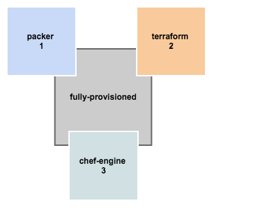

# Fully provisioned


Using the automation tools to prepare a FULLY provisioned cloud environment in AWS

## REQUIRED:
* update the aws-credentials.properties add the values for these variavles:
```
AWS_DEFAULT_REGION=
AWS_VPC_ID=
AWS_SUBNET_ID=
AWS_ACCESS_KEY_ID=
AWS_SECRET_ACCESS_KEY=
```

## 1 - Packer:
Build an immutable AWS AMI with Packer, based on json template
- variables: Custom variables that can be overriden during runtime by using the -var flag.
- builders: You can specify multiple builders depending on the target platforms (EC2, VMware, Google Cloud, Docker).
- provisioners: You can pass a shell script or use configuration managements tools like Ansible, Chef,
Puppet or Salt to provision the AMI and install all required packages and softwares.
[Packer web site](https://www.packer.io)

## 2 - Terraform:
Terraform is a tool for building, changing, and versioning infrastructure safely and efficiently.
Terraform can manage existing and popular service providers as well as custom in-house solutions.
[Terraform web site](https://www.terraform.io)

## 3 - Chef
Chef is a powerful automation platform that allows you to define your infrastructure as code to ensure
that configurations are applied consistently in every environment, at any scale.
[Chef web site](https://www.chef.io)

## Requeired Tools:
- Python 2.7
- Packer: https://www.packer.io/intro/getting-started/install.html
- Terraform
- JQ ```apt-get install jq```
- AWS-Cli: https://aws.amazon.com/cli/
- Chef Developer Kit

## Packer
* To create the AWS AMI base image, based in this [template](packer/template.tpl)

## Terraform
* Based on AMI_ID we are using the terraform to deploy the infrastrutura in AWS cloud.

## Chef-Engine
* To create the new coockbook ```chef generate cookbook fully-chef```
- The main Recipes: postgres 9.6, Nginx + PHP

## Infra and Chef Release
* To deploy the infra and chef on aws cloud execute create-infra with deploy/test parameter like this example:
```create-infra.sh test```
- test to check the packer and terraform files
- deploy to create the infrastruture on aws cloud provider
* To execute chef provision on all aws instances execute the chef-provison

