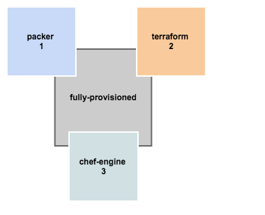

# Fully provisioned


Using the automation tools to prepare a FULLY provisioned cloud environment in AWS

## 1 - Packer:
Build an immutable AWS AMI with Packer, based on json template
- variables: Custom variables that can be overriden during runtime by using the -var flag.
- builders: You can specify multiple builders depending on the target platforms (EC2, VMware, Google Cloud, Docker).
- provisioners: You can pass a shell script or use configuration managements tools like Ansible, Chef,
Puppet or Salt to provision the AMI and install all required packages and softwares.

[Packer web site](https://www.packer.io)

## 2 - Terraform:
Terraform is a tool for building, changing, and versioning infrastructure safely and efficiently.
Terraform can manage existing and popular service providers as well as custom in-house solutions.

[Terraform web site](https://www.terraform.io)

## 3 - Chef
Chef is a powerful automation platform that allows you to define your infrastructure as code to ensure
that configurations are applied consistently in every environment, at any scale.

[Chef web site](https://www.chef.io)

## Requeired Tools:
- Terraform
- Packer
- JQ
- Python 2.7
- AWS-Cli
- Chef Developer Kit

## Packer

## Terraform

## Chef-Engine
- To create the new coockbook
```
kitchen init --create-gemfile
chef generate cookbook fully-chef
```
## Likns
- [Berks](https://docs.chef.io/berkshelf.html)
